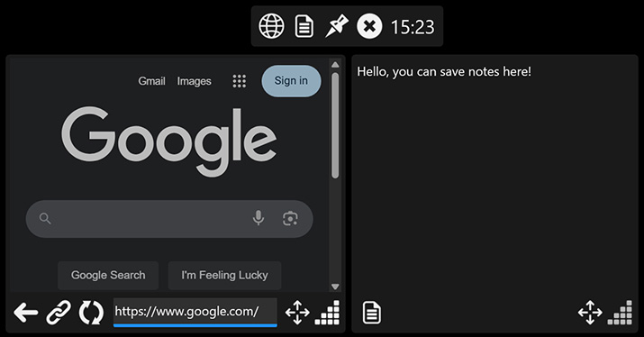

## Application Description
Fps Overlayer is an application that shows the current frames per second and hardware information,
it also features an separate overlay with a web browser, notepad, adjustable crosshair and more.

## Application Features
- Show current frame rate of a running application.
- Show processor, videocard and other hardware stats.
- Show a crosshair overlay to help you aim while gaming.
- Tool overlay with web browser, notes and more features.
- Move the overlay based on what application is running.
- Keyboard shortcuts to show and hide overlays on demand.
- Setting to hide overlay from screen captures you make.
- Does not use dll injection or game hooks of any kind.

## Installation Instructions
1) Extract the FpsOverlayer folder to any directory you want on your device.
2) Make sure that you have installed all the requirements listed below.
3) Run the Launcher executable and enjoy your new overlay.

## Uninstallation Instructions
1) Remove the extracted FpsOverlayer directory.

## Tips and tricks
- Let FpsOverlayer automatically launch on Windows startup for easier alltime usage.
- For more information and help open the "Help" window or tab in the application.

## Known issues
- Overlays may not always show up when you are in an exclusive fullscreen application.

## Requirements
- Microsoft .NET Core Runtime installed.
- Microsoft Windows 11 64-bit or higher is required.
- PawnIO driver (Automatically installs on first launch)

## Special thanks
- LibreHardwareMonitor community.

## Support and bug reporting
When you are walking into any problems or a bug you can go to my help page at https://help.arnoldvink.com so I can try to help you out and get everything working.

## Developer donation
If you appreciate my project and want to support me you can make a donation through https://donation.arnoldvink.com

## Changelog
v2.5.0.0 (22-September-2025)
- Added setting to show memory temperature.
- Switched from WinRing0 to PawnIO.

v2.2.0.0 (24-December-2024)
- Added notes to tool overlay.

v2.1.0.0 (11-July-2024)
- Added fan speed information support.
- Added address bar to browser overlay.

v2.0.0.0 (7-June-2024)
- Ported application to .NET8 framework.

v1.99.2.0 (29-September-2023)
- Added setting to show GPU memory speed and hotspot temperature.

v1.95.0.0 (22-March-2023)
- Added setting to show the current date.
- Added setting to change the average fps time span.
- Added setting to flip stats order when positioned on bottom.

v1.90.0.0 (21-February-2023)
- Added frametime graph.

v1.84.0.0 (13-January-2023)
- Added web browser overlay.

v1.12.1.0 (24-March-2020)
- Fps Overlayer can now show the current time.

v1.9.5.0 (29-October-2019)
- You can now set the fps overlayer position for each app.

v1.3.5.0 (5-June-2019)
- First official test release.